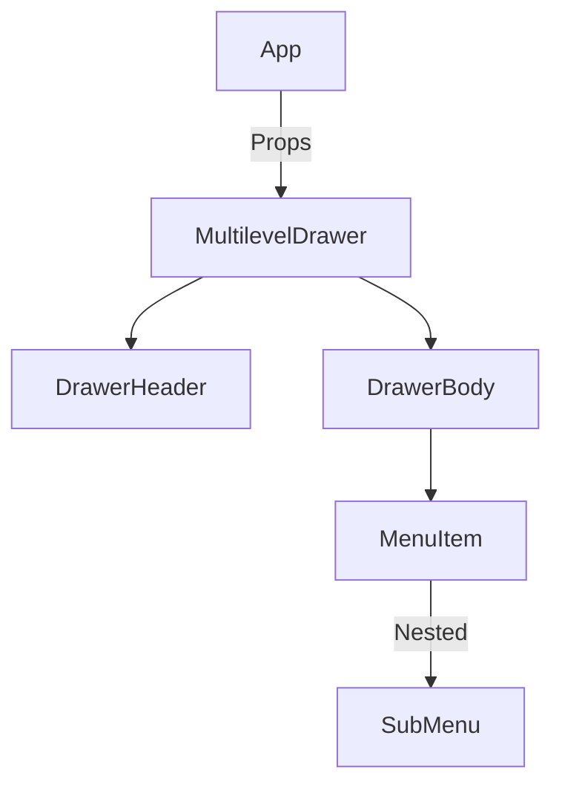
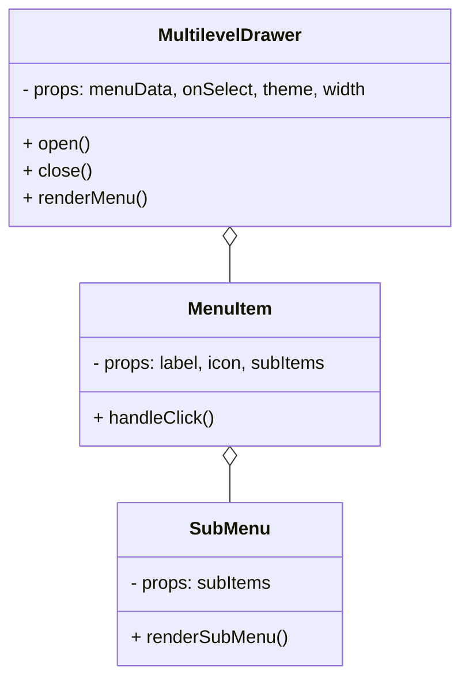
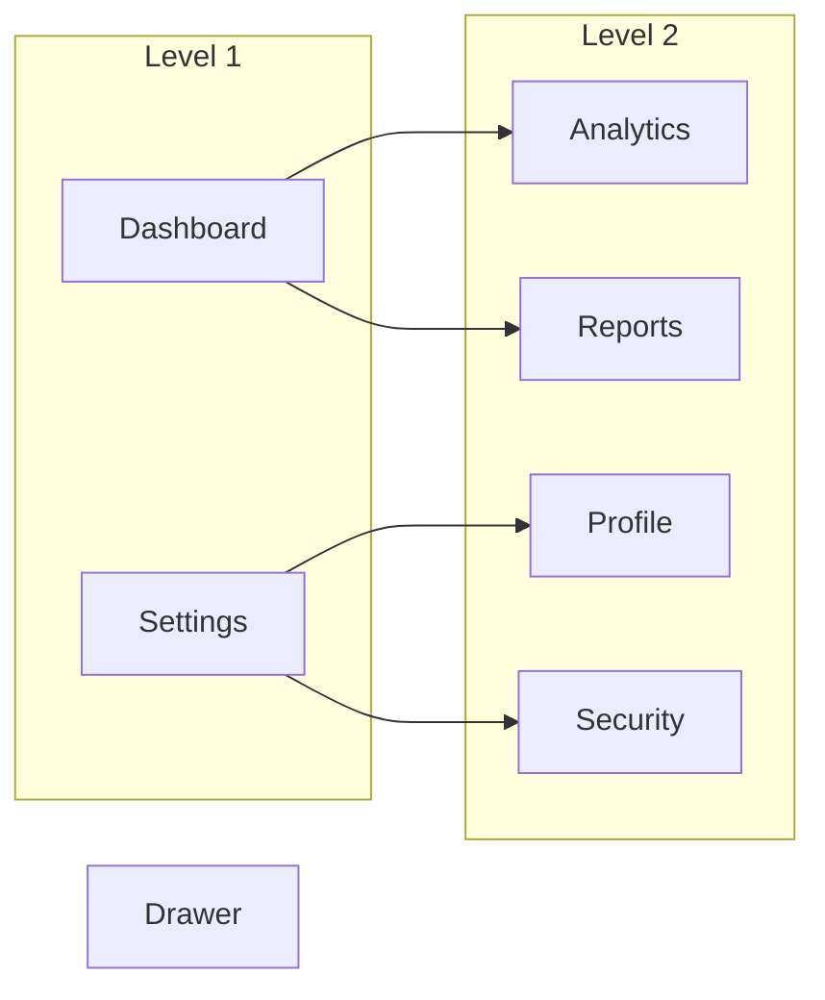

# FRONTEND-NEW-MULTILEVEL-DRAWER

A modern, highly-configurable React component for building multilevel side drawers or menus. Designed for scalability, clean UI, and rapid integration into any frontend project.

---

## Overview

The **Multilevel Drawer** is a reusable UI component that enables nested navigation menus within a sliding drawer interface. It's perfect for dashboards, admin panels, or any application requiring hierarchical navigation.

### Key Features

- **Multi-level support:** Nest any number of menu levels.
- **Customizable appearance:** Theme, width, icons, and more.
- **Smooth animations:** Responsive sliding transitions.
- **Accessible:** Keyboard navigation and screen reader support.
- **Easy integration:** Simple API for menu data and event handling.

---

## Architecture

Below is a high-level diagram of how the drawer component fits into a typical React application:



---

## Component Structure



---

## Usage

### Installation

```bash
npm install multilevel-drawer
```

### Example

```jsx
import MultilevelDrawer from 'multilevel-drawer';

const menuData = [
  {
    label: 'Dashboard',
    icon: '📊',
    subItems: [
      { label: 'Analytics', icon: '📈' },
      { label: 'Reports', icon: '📄' },
    ],
  },
  {
    label: 'Settings',
    icon: '⚙️',
    subItems: [
      { label: 'Profile', icon: '👤' },
      { label: 'Security', icon: '🔒' },
    ],
  },
];

function App() {
  return (
    <MultilevelDrawer
      menuData={menuData}
      theme="light"
      width={300}
      onSelect={(item) => console.log('Selected:', item)}
    />
  );
}
```

---

## How It Works

- **Menu Rendering:** The drawer receives a `menuData` array and recursively renders each item. If an item has `subItems`, it creates a nested submenu.
- **State Management:** The drawer manages open/close state and tracks the current navigation path.
- **Events:** Clicking a menu item without subItems triggers the `onSelect` callback.

---

## Preview

Below is a conceptual preview of a 2-level drawer:



---

## Accessibility

- Full keyboard navigation:
    - Tab/Shift+Tab to move between items
    - Arrow keys to traverse levels
- ARIA attributes for screen readers

---

## Contributing

1. Fork the repo
2. Create a feature branch
3. Submit a PR with clear description and diagrams if relevant

---

## Contact

For issues, feature requests, or questions, please open a GitHub issue or contact the repository owner.
